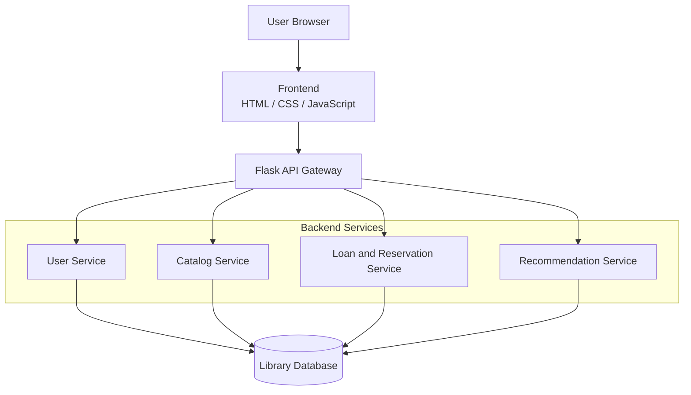
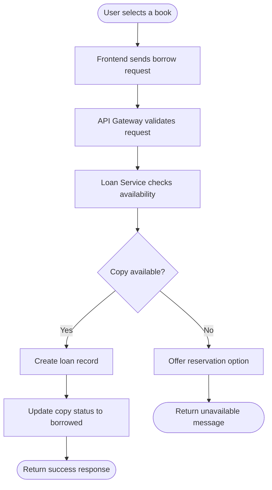
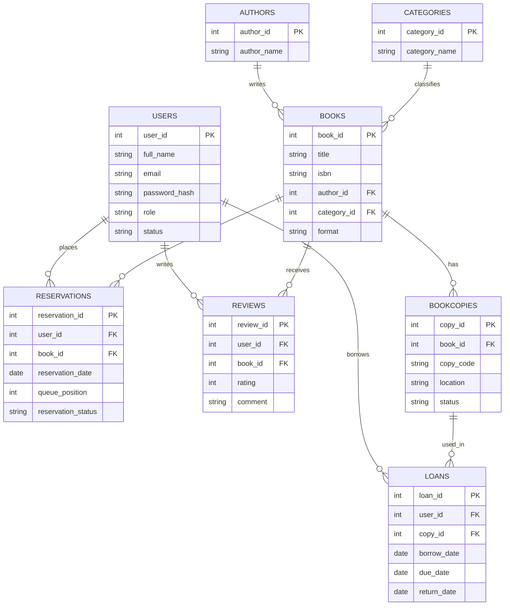

# System Design

## System Architecture

```mermaid
flowchart TD
    U[User Browser] --> F[Frontend<br/>HTML / CSS / JavaScript]
    F --> A[Flask API Gateway]

    subgraph BackendServices[Backend Services]
        US[User Service]
        CS[Catalog Service]
        LS[Loan and Reservation Service]
        RS[Recommendation Service]
    end

    A --> US
    A --> CS
    A --> LS
    A --> RS

    DB[(Library Database)]

    US --> DB
    CS --> DB
    LS --> DB
    RS --> DB
```

## Borrowing Flow

```mermaid
flowchart TD
    A([User selects a book]) --> B[Frontend sends borrow request]
    B --> C[API Gateway validates request]
    C --> D[Loan Service checks availability]
    D --> E{Copy available?}
    E -- Yes --> F[Create loan record]
    F --> G[Update copy status to borrowed]
    G --> H([Return success response])
    E -- No --> I[Offer reservation option]
    I --> J([Return unavailable message])
```

## ER Diagram

```mermaid
erDiagram
    USERS ||--o{ LOANS : borrows
    USERS ||--o{ RESERVATIONS : places
    USERS ||--o{ REVIEWS : writes

    AUTHORS ||--o{ BOOKS : writes
    CATEGORIES ||--o{ BOOKS : classifies
    BOOKS ||--o{ BOOKCOPIES : has
    BOOKS ||--o{ RESERVATIONS : reserved_in
    BOOKS ||--o{ REVIEWS : receives
    BOOKCOPIES ||--o{ LOANS : used_in

    USERS {
        int user_id PK
        string full_name
        string email
        string password_hash
        string role
        string status
    }

    AUTHORS {
        int author_id PK
        string author_name
    }

    CATEGORIES {
        int category_id PK
        string category_name
    }

    BOOKS {
        int book_id PK
        string title
        string isbn
        int author_id FK
        int category_id FK
        string format
    }

    BOOKCOPIES {
        int copy_id PK
        int book_id FK
        string copy_code
        string location
        string status
    }

    LOANS {
        int loan_id PK
        int user_id FK
        int copy_id FK
        date borrow_date
        date due_date
        date return_date
    }

    RESERVATIONS {
        int reservation_id PK
        int user_id FK
        int book_id FK
        date reservation_date
        int queue_position
        string reservation_status
    }

    REVIEWS {
        int review_id PK
        int user_id FK
        int book_id FK
        int rating
        string comment
    }
```